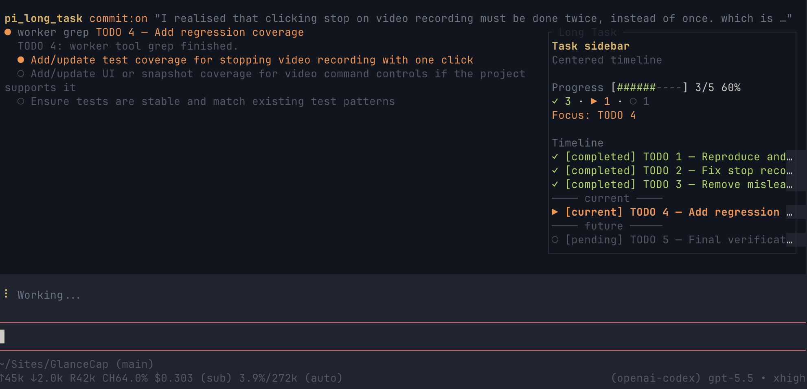

# Pi Long Task

[](https://www.npmjs.com/package/pi-long-task)
[](https://nodejs.org/)
[](LICENSE)

**Pi Long Task** is a long-running task runner and subagent orchestrator for the [Pi coding agent](https://github.com/earendil-works/pi). It is a Pi extension that breaks large coding requests into tracked TODOs, executes them in bounded AI worker sessions, registers a real Pi TUI progress sidebar while a run is active, and optionally commits completed work.

If you are looking for a way to run long-running, multi-step, autonomous coding tasks with Pi — refactors, test coverage pushes, full feature builds, or entire product goals — this extension handles the planning, delegation, progress tracking, retries, and safe git commits for you.

Use it when a coding request is bigger than one focused interaction. Pi Long Task creates or cleans up the TODO plan, gives every TODO a task-scoped assignment, adaptively reuses a healthy compatible worker session when safe, tracks every attempt, and keeps the run artifacts so you can inspect what happened later.

## Why use it

- **Take on bigger tasks:** split broad product, refactor, testing, or cleanup requests into smaller TODOs that Pi can complete one at a time.
- **Track progress visibly:** in Pi TUI, see the active TODO, inferred `**Status:**` subtasks, completed/failed/blocked counts, and remaining work in the Pi Long Task sidebar while the run is active.
- **Recover with retries:** tasks that do not report completion can be retried with context from previous attempts instead of losing the thread.
- **Wait through transient outages:** optionally pause after Pi exhausts its bounded provider retries, show connection-wait status, and safely resume the interrupted coordinator phase.
- **Commit safely when asked:** enable commits for completed task work, while generated run files and pre-existing dirty files are kept out of those commits.
- **Keep task artifacts:** every run writes a generated `TODO.md`, generated `TASK_RESULT.md`, attempt summaries, and final status under `tmp/pi-long-task/<run-id>/`.
- **Watch cost visibility:** worker spend is captured and surfaced in progress and final summaries when usage cost data is available.

## What happens during a run

When you ask Pi to run a long task, Pi Long Task:

1. Recognizes natural-language requests like "run a long task with commits" and routes them to `pi_long_task`.
2. Creates or cleans up a TODO plan from your request, optionally guided by a high-level `goal`. Natural-language planning uses a bounded planner session; if generated TODO markdown is invalid, Pi Long Task asks the planner to repair it once before failing the run.
3. Works through each unfinished TODO task in order, reusing a healthy compatible worker session when its context remains safely below the configured limit and rotating otherwise.
4. Registers a Pi TUI sidebar/widget when UI support is available and updates it with the current task, inferred subtask progress, and full task timeline while the run is active.
5. Retries unfinished tasks up to the configured attempt limit.
6. Records progress, planner diagnostics, task artifacts, and final results under `tmp/pi-long-task/<run-id>/`.
7. Returns a summary with completed, failed, blocked, and remaining task counts, plus worker spend when available.
8. Optionally commits completed work after each task.

For a large project goal, this means Pi Long Task turns the single broad request into structured TODO tasks first, then assigns each TODO to a worker session one at a time. For example, a hypothetical request to build a fast team chat app would become a plan of focused tasks instead of one giant all-at-once implementation; workers would complete or report on each task incrementally before the coordinator moves to the next task.

During and after a run you get:

- a concise status summary in Pi
- a generated `TODO.md`
- a generated `TASK_RESULT.md`
- live TUI sidebar progress during the run for the active task and its `**Status:**` checkbox subtasks
- task attempt history and any remaining or blocked tasks clearly listed
- worker spend when cost data is available
- commit hashes when commits were enabled and created

## Install

Install it from npm with:

```bash
pi install npm:pi-long-task
```

For local development, load this checkout for one Pi session:

```bash
pi -e /path/to/pi-long-task
```

Or install the local checkout so Pi can load it normally:

```bash
pi install /path/to/pi-long-task
```

After installing, start `pi` in your target project and ask it to run a long task.

To update an existing npm install:

```bash
pi update npm:pi-long-task
```

Or update all installed Pi extension packages:

```bash
pi update --extensions
```

## Quick start examples

Use natural language; you do not need to mention `pi_long_task` explicitly. Copy one of these prompts and replace the quoted work with your own task.

Run with commits enabled, so each completed TODO can be committed separately:

```text
Run a long task with commits to implement the TODOs in @TODO.md.
```

```text
Run a long task with commits to refactor the checkout flow, update the tests, and commit each completed task.
```

Request commits and a coverage target in the same natural-language prompt:

```text
Run a long task with commits with goal to have testing line coverage above 80%.
```

Run without commits when you want to review all changes yourself before committing:

```text
Run a long task without commits to add tests for the parser and fix any failures.
```

```text
Run a long task without commits to audit the README examples and leave the final diff uncommitted.
```

### What "with commits" means

When you ask for a long task "with commits," Pi Long Task may create a git commit after each TODO task that a worker completes with eligible changes. Each worker session is expected to stay focused on its assigned TODO only, so any commit reflects a specific slice of progress rather than the entire broad request.

Those incremental commits preserve completed work between worker sessions, make it easier to review what changed for each task, and provide clear checkpoints if a later task is blocked or needs another attempt.

### Scope expectations for broad product goals

A hypothetical request like "run a long task with commits to build a fast Slack alternative" is too large and vague to finish as one instant product build. Pi Long Task would first turn that broad goal into a realistic plan, often centered on an MVP rather than every feature of a full Slack replacement.

The generated plan would break the work into focused areas such as authentication, workspace/channel data, message creation and history, realtime sync, persistence, UI screens, tests, and deployment or configuration follow-up. Each area would become one or more TODO tasks assigned to separate worker sessions, with incremental verification and optional commits along the way.

The initial result should be expected to be a structured TODO plan, MVP-oriented breakdown, or first narrow implementation slice. A complete production-ready team chat product would require many focused tasks and repeated progress checks, not a single vague prompt completing everything immediately.

## How to run a Long Task

### 1. Prepare the work request

Pi Long Task can plan from a plain-language request or from pasted TODO markdown. If you write the TODO markdown yourself, use this structure:

```markdown
# Pi Long Task TODO

Global instructions:

- Keep any rule that applies to every task here.

## Progress

- [ ] TODO 1 — First focused task
- [ ] TODO 2 — Second focused task

---

## TODO 1 — First focused task

**Goal:** Explain the outcome for this task.

**Status:**

- [ ] Implement the first focused task

**Verify:**

- Run the focused check for this task.

**Done when:**

- The task is implemented and verified.

## TODO 2 — Second focused task

**Goal:** Explain the outcome for this task.

**Status:**

- [ ] Implement the second focused task

**Verify:**

- Run the focused check for this task.

**Done when:**

- The task is implemented and verified.
```

### 2. Start Pi in the target project

Install or load the extension first, then run Pi from the repository you want to modify:

```bash
cd /path/to/your/project
pi
```

In the Pi prompt, use natural language:

```text
Run a long task without commits to implement the TODOs in @TODO.md.
```

Or call the tool explicitly:

```text
Use pi_long_task with inputText "implement the TODOs in @TODO.md" and commit false.
```

Use `with commits` or `commit true` only when you want Pi Long Task to create eligible commits after completed tasks.

### 3. Monitor progress and completion

During execution, Pi Long Task creates `tmp/pi-long-task/<run-id>/TODO.md` and `TASK_RESULT.md`, runs unfinished TODOs in order with adaptive worker-session reuse, and retries unfinished tasks up to the configured attempt limit. Every assignment remains task-scoped even when its SDK session is reused. Checked progress in pasted TODO markdown is preserved, so completed tasks are skipped when that artifact is supplied again. A task is marked complete only after the worker returns every required `TASK_RESULT` field without a session error, timeout, or cancellation, and the attempt evidence is appended before the TODO completion marker. In Pi TUI, watch the Long Task sidebar/widget for the active task, subtask checklist, task timeline, counts, and worker spend when available. In headless or non-UI runs, watch the partial tool-result updates in the main output. When the run finishes, the final response lists completed, failed, blocked, and remaining task counts plus the result and TODO file paths.

### Steer a run in progress

While one Pi Long Task is active, send another plain-text message in the Pi prompt to refine the remaining work. For example:

```text
Add an accessibility review before the documentation task, and require pagination tests for the API task.
```

Pi acknowledges the guidance immediately, queues rapid messages in submission order, and asks the planner to incorporate each message into the current complete plan. Accepted guidance may edit pending tasks, add or remove work, or reorder the unfinished tasks. The updated `TODO.md` and sidebar use the revised order, and the same run continues from the next eligible task instead of starting over.

Progress is reconciled conservatively:

- Equivalent completed tasks stay checked and are not run again; their result evidence remains available to later workers.
- If guidance changes completed work, the completed result is retained as history and corrective work is represented as a new unchecked follow-up rather than erasing the old result.
- If guidance changes or removes the currently running task, that worker may finish, but its stale result is recorded as obsolete and cannot complete the replacement. The scheduler then runs the revised task.
- A revision must be a complete valid Pi Long Task TODO plan. If generation or validation fails, Pi reports the rejection and keeps executing the prior plan unchanged.
- Guidance received close to task completion is serialized with the completion update so the rendered checkboxes and scheduler state remain consistent.

Steering applies to text submitted with Pi's active-session steering behavior. Slash commands, shell commands beginning with `!`, image messages, follow-up messages deferred until after the response, and extension-generated input retain their existing behavior instead of revising the plan. If more than one long-task run is active in the same extension session, guidance is not guessed between them.

## What it looks like



In Pi TUI, Pi Long Task keeps worker activity in the main tool result flow and registers a real right-side TUI sidebar for the run timeline:

```text
┌─ Main content: active worker activity ─────────┬─ Pi Long Task sidebar ─────────┐
│ Worker TODO 2 — Add parser tests               │ Progress: 2/5 tasks complete   │
│                                                │ Worker spend: $0.18            │
│ $ npm test -- parser                           │                                │
│ ✓ parser handles nested arrays                 │ Timeline                       │
│ ✗ parser rejects invalid escapes               │ ✓ TODO 1 Rewrite intro done    │
│                                                │ ▶ TODO 2 Add tests active      │
│ Editing src/parser.test.ts...                  │   ◌ add edge fixtures          │
│ Re-running tests after fix...                  │   ◌ fix assertions             │
│                                                │ ○ TODO 3 Update docs next      │
│ Worker reports commands, edits, results here.  │ ○ TODO 4 Validate later        │
│ Current TODO output stays in main thread.      │ Tracks status/timeline/spend   │
└────────────────────────────────────────────────┴────────────────────────────────┘
```

The actual sidebar is a Pi TUI overlay anchored on the right when the terminal is large enough, with a Pi widget fallback for UI contexts where the overlay is unavailable. It is cleared when the run finishes; this README mockup stays narrow enough to avoid wrapping in package galleries.

## How it works

Pi Long Task coordinates a long request from planning through task completion:

1. **Plan the work:** it creates a TODO plan from your request, or normalizes pasted TODO markdown so each item can be tracked consistently.
2. **Run bounded workers:** each TODO receives a new task-scoped assignment with the relevant task text, global instructions, attempt history, and commit setting. A healthy compatible SDK worker session may carry sequential assignments; each reused prompt includes an explicit assignment boundary.
3. **Stream progress back:** the active worker's activity streams into the main Pi thread as partial tool results, so you can follow commands, edits, verification, and the final `TASK_RESULT` as they happen.
4. **Update the Pi TUI sidebar:** when Pi provides UI support, the extension uses Pi's TUI UI APIs to maintain a real sidebar/widget that lists the full run timeline, including completed, active, upcoming, failed, or blocked tasks and inferred subtask progress from each task's `**Status:**` checklist.
5. **Write run artifacts:** the coordinator writes the generated/normalized `TODO.md`, `TASK_RESULT.md`, attempt summaries, and final run details to `tmp/pi-long-task/<run-id>/`.
6. **Commit only when enabled:** if `commit` is `true`, Pi Long Task may create a commit after each completed task using only eligible task changes. If commits are disabled, no commits are created; even when enabled, commits can be skipped when there are no eligible changes or the task outcome is not commit-worthy.

### Adaptive worker-session reuse

Reuse is enabled by default. Related sequential TODOs in the same coordinator run and worktree may share one idle Pi `AgentSession`, which avoids repeated startup and repository exploration. Reuse does not merge task semantics: every TODO still gets its complete current assignment, an explicit boundary from the previous assignment, its own result extraction, attempts, progress, and `TASK_RESULT` outcome.

The default context-usage threshold is **62.5%**. A session is retained only while Pi reports valid context usage below that threshold. It is rotated at or above the threshold, or conservatively when context usage is missing or invalid. Rotation also occurs after timeout, abort, cancellation, unrecoverable or invalid session state, an obsolete assignment caused by steering, or a compatibility change in the coordinator run, repository/worktree, provider/model, worker options, or session configuration. All retained sessions are disposed when rotated or when the coordinator ends.

You can put runtime directives in `inputText` (including pasted TODO global instructions):

```text
Worker session reuse: enabled
Worker session reuse context threshold: 60%
```

The threshold accepts a percentage greater than `0` and at most `100`. An absent or invalid value uses the safe `62.5%` default. To restore the previous one-session-per-assignment behavior:

```text
Worker session reuse: disabled
```

Programmatic callers of `runCoordinator()` can use the corresponding options:

```ts
await runCoordinator({
  commit: false,
  inputText: "implement the TODO plan",
  workerSessionReuse: true,
  workerSessionReuseContextThresholdPercent: 60,
});
```

Explicit, complete `status: partial` results may continue in the same healthy, compatible, below-threshold session on the next attempt. All independent retries—including timeout, abort, cancellation, errors, invalid/incomplete results, and non-partial failures—start fresh. Existing retry limits and delays are unchanged. Setting `workerSessionReuse: false` (or the disabling directive) always isolates assignments.

### Coordinator-level network recovery

Network recovery is **disabled by default** for backward compatibility. When enabled, it begins only after Pi has exhausted its own bounded provider-request retries. Pi Long Task then uses jittered exponential backoff starting at **1 second**, capped at **30 seconds**, for a maximum continuous outage of **5 minutes**. During recovery, progress displays `Waiting for connection…` with the retry number, next retry delay, or elapsed outage time. Cancellation interrupts both backoff waits and in-flight recovery calls immediately.

Add directives to `inputText` or to the global instructions of a pasted TODO plan. These examples cover every mode:

```text
# Default: recovery is disabled; the timing defaults below are dormant.
Run a long task without commits to implement @TODO.md.
```

```text
# Bounded recovery using the default 1s base, 30s cap, and 5m outage window.
Network recovery: enabled
```

```text
# Bounded recovery with explicit timing.
Network recovery: enabled
Network recovery base delay: 2s
Network recovery maximum delay: 45s
Network recovery maximum outage: 10m
```

```text
# Explicitly retain fail-fast behavior after Pi's own request retries.
Network recovery: disabled
```

To wait indefinitely while the provider or network remains unavailable, enable recovery and set the maximum outage to `unlimited`, `indefinite`, or `until cancelled`:

```text
Network recovery: enabled
Network recovery maximum outage: until cancelled
```

Indefinite mode has no outage deadline; it always remains cancellable. It does not turn deterministic errors into recoverable ones.

Programmatic `runCoordinator()` callers can pass the same policy as structured options; `pi_long_task` and `pi_goal_task` expose the same `networkRecovery` object in their tool parameters:

```ts
await runCoordinator({
  commit: false,
  inputText: "implement the TODO plan",
  networkRecovery: {
    enabled: true,
    baseDelayMs: 2_000,
    maxDelayMs: 45_000,
    maxOutageMs: 10 * 60_000,
  },
});
```

Use `maxOutageMs: null` for indefinite waiting or `enabled: false` to disable recovery. Durations must be positive finite safe integers, `maxDelayMs` must be at least `baseDelayMs`, and a bounded `maxOutageMs` must be at least `baseDelayMs`.

#### Recovery classification boundaries

Recovery is deliberately narrow. Recoverable failures include failed fetches; DNS, connection, and socket failures such as `ENOTFOUND`, `ECONNRESET`, or `ETIMEDOUT`; premature HTTP/WebSocket/stream termination; request and gateway timeouts; temporary provider overload; HTTP 408, 425, and overload-style 429 responses; and retryable server responses such as HTTP 500, 502, 503, and 504. Provider errors and nested causes are inspected so useful status, code, request ID, and retry metadata can be retained.

Authentication and authorization failures, billing or credit failures, exhausted account/usage quota, invalid models, malformed or unsupported requests, context-length and content-policy failures, most other 4xx responses, non-retryable server responses, certificate/configuration failures, coordinator timeouts, cancellation, and unknown errors fail immediately through the existing error path. Deterministic evidence wins over transient-looking wrapper text—for example, a 429 response that says the account quota is exhausted is not treated as temporary rate limiting.

#### Timeouts, limits, and preserved state

Network retries have their own counter and outage window. Recovery waits do not consume TODO attempts, planner repair retries, reviewer retries, or goal-loop iterations. Time attributed to network recovery is excluded from worker, TODO-planner, reviewer, goal-iteration, and overall goal-loop timeout budgets; while connectivity is unavailable, `maxOutageMs` (or cancellation in indefinite mode) is the recovery limit. Once the operation resumes, its ordinary timeout and retry rules still apply. If the outage window expires, the run fails with the last classified network failure retained as evidence.

Completed TODOs, current TODO identity and ordinary attempt number, durable attempt evidence, working-tree changes, accepted steering revisions, accumulated costs, and persisted goal/review state remain intact across an outage. An interrupted worker resumes the same TODO in a fresh session: the errored session is rotated, and the continuation is told to inspect the result artifact and current files before acting. This avoids blindly replaying already completed tool calls. The coordinator does not roll back external side effects, so tasks that call non-idempotent external systems should record durable completion/idempotency evidence that a resumed worker can verify.

### Reuse diagnostics and accounting

Programmatic progress callbacks receive lifecycle updates with `phase: "worker_session"`. The additive fields are:

- `workerSessionEvent`: `session_started`, `session_reused`, `session_retained`, or `session_rotated`
- `workerSessionReason`: a stable diagnostic reason such as `fresh_session`, `reuse_eligible`, `context_threshold_reached`, `health_timed_out`, `model_mismatch`, or `reuse_disabled`
- `workerSessionContextUsagePercent`: the observed context percentage when available
- `workerSessionContextThresholdPercent`: the configured rotation threshold

Each coordinator outcome may also include `sessionDiagnostics` entries with `event`, `reasonCode`, optional `contextUsagePercent`, optional `contextThresholdPercent`, and optional `previousTaskId`. These diagnostics are appended to the run's `TASK_RESULT.md`. The programmatic `CoordinatorResult.workerSessionMetrics` summarizes `starts`, `reuses`, `rotations`, `retained`, and counts by `rotationReasons` without removing or changing existing result fields.

Pi session statistics can be cumulative across reused assignments. `outcomes[].workerCostTotal` and `outcomes[].workerUsage` are therefore calculated as nonnegative **task/attempt-level deltas** between assignment boundaries, not as the cumulative session totals. `CoordinatorResult.workerCostTotal` and `workerUsageTotal` aggregate those deltas exactly once across reuse, retries, and rotation; a statistics reset starts a new baseline. This keeps sidebar spend and the cost added to the parent Pi message task-accurate even when one session performs several TODOs.

## Feature reference

- **Adaptive worker-session reuse:** reuse healthy compatible sessions below the 62.5% default context threshold, while preserving task boundaries and rotating conservatively.
- **Optional network recovery:** wait through classified transient provider/transport outages without consuming ordinary attempts, while keeping deterministic failures fail-fast and cancellation immediate.
- **Real Pi TUI sidebar:** in TUI sessions, every TODO appears in a registered sidebar/widget with past, current, and future statuses so you can distinguish completed, active, upcoming, failed, blocked, and remaining work at a glance.
- **Main-thread worker activity:** the active worker still streams commands, edits, verification, and its per-task `TASK_RESULT` back into the main Pi conversation; the sidebar does not replace tool-result rendering.
- **Cost visibility:** worker spend is included in Pi Long Task progress and is added to the main Pi `$ spent` total when cost data is available.
- **Result and TODO artifacts:** each run keeps the generated or normalized `TODO.md`, aggregate `TASK_RESULT.md`, per-attempt summaries, and final run details under `tmp/pi-long-task/<run-id>/`.
- **Commit-safe behavior:** when commits are enabled, Pi Long Task commits only eligible completed-task changes and skips generated run files.
- **Dirty-worktree protection:** files that were dirty before a worker started are not included in Pi Long Task commits, keeping your existing local work separate.

## Usage

You can also call the tool explicitly.

Run without commits:

```text
Use pi_long_task with inputText "add tests for the parser and fix any failures" and commit false.
```

Run with commits:

```text
Use pi_long_task with inputText "implement the TODOs in @TODO.md" and commit true.
```

Run with an explicit high-level goal for the planner and worker prompts:

```text
Use pi_long_task with inputText "update the checkout TODOs" and commit false and goal "ship a reliable checkout recovery experience".
```

When a goal is enough context, `inputText` can be omitted:

```text
Use pi_long_task with commit true and goal "have testing line coverage above 80%".
```

Use a pasted TODO plan:

```text
Use pi_long_task with inputText "<paste TODO markdown here>" and commit false.
```

## Goal-oriented iterative loop

Use `pi_goal_task` when you have a high-level outcome instead of a ready TODO plan and want Pi Long Task to keep iterating until a reviewer confirms the goal is complete.

```text
Use pi_goal_task with goal "modernize the settings page, add tests, and update docs" and commit true.
```

Goal loops default to `commit true`, `minIterations 1`, `maxIterations 50`, a 48-hour total timeout, 3 hours per implementation iteration, and 30 minutes per reviewer pass. Override limits when you want a larger or smaller loop. When you explicitly set `maxIterations` without `minIterations`, that number also becomes the minimum target, so the loop will not stop early just because a reviewer found one pass complete.

Examples:

```text
Run a goal task with commits for goal: build a full Slack alternative chat app focused on speed.
```

```text
Use pi_goal_task with goal "build a full Slack alternative chat app focused on speed" and commit true and minIterations 100 and maxIterations 100.
```

```text
Use pi_goal_task with goal "ship a polished analytics dashboard with onboarding, tests, docs, and launch notes" and commit false and maxIterations 20.
```

For broad software-product goals like the Slack example, `pi_goal_task` first creates a software/product specification, then generates implementation TODOs from that spec, runs them, reviews completion, and repeats until the spec is complete and the minimum iteration target is reached, or until safety limits stop the loop.

### Discovery for vague software goals

When a `pi_goal_task` goal is vague, such as a short product direction or broad feature idea, the goal loop first runs software-focused discovery before implementation TODOs are generated. Discovery turns the original goal into a persisted product definition and definition-of-done so implementation workers do not have to guess the scope.

Discovery uses role-based planning outputs from these supported roles:

- Product Owner
- Project Manager
- Software Architect/Tech Lead
- UX/UI Designer
- QA/Reviewer
- Marketing/Growth, when relevant for user-facing launch or adoption context

The consolidated specification is saved as `GOAL_SPEC.json` under the goal run directory. It includes traceability to the original user goal, role-output summaries, in-scope and out-of-scope requirements, assumptions, open questions, milestones, acceptance criteria, verification gates, design constraints, product constraints, optional marketing/growth context, and a definition-of-done with required artifacts and notes.

For vague goals, the loop runs as:

1. accept the high-level `goal`
2. classify the goal as vague and run discovery
3. persist `GOAL_SPEC.json`
4. generate implementation TODO markdown from the persisted specification
5. run that generated TODO as a normal task-scoped long-task coordinator run
6. run a separate reviewer session that decides `complete`, `incomplete`, `blocked`, or `failed` against the persisted specification
7. if the reviewer says `incomplete`, generate another TODO using previous review context plus the same persisted specification and repeat

Implementation TODO generation treats the persisted specification as the source of truth. Generated tasks are instructed to cover relevant requirement, milestone, acceptance-criterion, verification-gate, constraint, and definition-of-done items, including spec IDs such as `REQ-*`, `MS-*`, `AC-*`, and `VG-*` where applicable. Reviewer sessions also load the persisted specification and use it as the primary review target; the original goal remains available for traceability, but vague wording alone is not the completion standard.

### Concrete goals and compatibility

When a `pi_goal_task` goal is already concrete, existing direct behavior is preserved: the loop skips discovery and generates implementation TODOs from the provided goal, previous iteration context, and reviewer feedback. Goals are generally considered concrete when they already include implementation details such as files or paths, specific commands/tests, explicit acceptance criteria, or enough detailed scope for direct TODO generation.

`pi_long_task` behavior is unchanged. Discovery is only enabled by default for `pi_goal_task`; direct long-task planning, TODO normalization, worker execution, progress display, retries, artifacts, and commit behavior continue to work as before.

Goal-loop artifacts are stored under `tmp/pi-goal-task/<goal-run-id>/`, including `GOAL_STATE.json`, `GOAL_TRACE.jsonl`, `GOAL_RESULT.md`, optional `GOAL_SPEC.json` for discovered goals, and per-iteration generated TODO, worker, and reviewer files. Persisted `pending`, `todo_generated`, `todo_executed`, `failed`, and reviewed boundaries can be resumed by SDK callers without rerunning completed phases or rewriting existing result/trace history. Child TODO execution still writes normal `tmp/pi-long-task/<run-id>/` artifacts.

Safety controls:

- `minIterations` prevents early success before the requested number of loops; default is `1`.
- `maxIterations` stops retry loops when the reviewer keeps finding remaining work; default is `50`. If explicitly provided without `minIterations`, it is also used as the minimum target.
- `timeoutMs` caps the overall goal loop; default is `172800000` ms (48 hours).
- `iterationTimeoutMs` caps each generation, execution, and review sequence; default is `10800000` ms (3 hours).
- `reviewerTimeoutMs` caps each reviewer session within the remaining overall and iteration budgets; default is `1800000` ms (30 minutes).
- tool cancellation is passed through, bounded locally even if an SDK prompt does not settle after abort, and stops the loop with `cancelled` status.
- `networkRecovery` applies the same coordinator recovery policy to discovery, TODO generation/execution, and review; its wait time is excluded from goal-loop deadlines and iteration counts.
- `maxAttemptsPerTask` and `maxBashTimeoutMs` are forwarded to worker long-task runs.
- `commit` controls whether implementation workers may commit; goal loops default to `commit true`, so pass `commit false` when you want to review all changes first.

## Options

`pi_long_task` has one required input and three optional inputs:

```ts
{
  commit: boolean;
  inputText?: string;
  goal?: string;
  networkRecovery?: {
    enabled?: boolean;
    baseDelayMs?: number;
    maxDelayMs?: number;
    maxOutageMs?: number | null;
  };
}
```

- `commit` controls whether Pi Long Task may create git commits.
- `inputText` optionally provides the request or TODO markdown to work on.
- `goal` optionally provides a high-level desired outcome that is passed to TODO planning and worker task prompts. Coverage goals such as `have testing line coverage above 80%` add coverage-specific planning and verification guidance.
- `networkRecovery` optionally enables and tunes coordinator-level transient network recovery. See [Coordinator-level network recovery](#coordinator-level-network-recovery) for defaults and safety behavior.

`pi_goal_task` accepts a high-level goal plus safety controls:

```ts
{
  goal: string;
  commit?: boolean;
  minIterations?: number;
  maxIterations?: number;
  timeoutMs?: number;
  iterationTimeoutMs?: number;
  reviewerTimeoutMs?: number;
  maxAttemptsPerTask?: number;
  maxBashTimeoutMs?: number;
  networkRecovery?: {
    enabled?: boolean;
    baseDelayMs?: number;
    maxDelayMs?: number;
    maxOutageMs?: number | null;
  };
}
```

Use `pi_goal_task` for iterative goal completion. Vague `pi_goal_task` goals enter discovery and persist `GOAL_SPEC.json`; already concrete goals keep the direct implementation path. Use `pi_long_task` when you already have a concrete request or TODO markdown and want one planned long-task run.

Example explicit goal-task calls:

```text
Use pi_goal_task with goal "build a full Slack alternative chat app focused on speed" and commit true.
```

```text
Use pi_goal_task with goal "build a full Slack alternative chat app focused on speed" and commit true and minIterations 100 and maxIterations 100 and timeoutMs 1296000000.
```

For natural-language requests, Pi Long Task routes phrases like "run a long task with commits" to the tool with commits enabled. Phrases like "with goal to have testing line coverage above 80%" are parsed into the `goal` option. If you ask for a long task without mentioning commits, commits stay disabled.

Natural-language routing intentionally avoids informational questions, such as "How do I run a long task with commits?", and explicit tool calls are left unchanged.

No other public options are required.

## Progress display

While a task is running, Pi Long Task shows the active TODO and subtasks parsed from that task's `**Status:**` checkbox list. In Pi TUI this appears in the live sidebar/widget; in headless or non-UI contexts the same progress is still published through partial tool results.

Status markers are:

- `○` not started
- green `●` done
- orange `●` inferred as in progress

Because workers currently report structured results at the end of a task, in-progress subtask state is inferred: the first unchecked status item is shown as in progress while the task runs.

## Commits and files

When `commit` is `false`, Pi Long Task never creates commits.

When `commit` is `true`, it may commit eligible task changes after a task reports useful progress. It avoids committing:

- generated run files under `tmp/pi-long-task/`
- generated `TASK_RESULT.md` files
- files that were already dirty before the task's first attempt (the same protected baseline is retained across retries)

This lets you keep existing local work separate from Pi Long Task changes.

Commit messages are generated from the task title and adjusted to resemble recent commit-message style in the repository. Pi Long Task does not prefix commits with generated labels like `Complete TODO 1 — ...`.

## Runtime compatibility

Pi Long Task requires Node.js 22.19 or newer, matching the supported runtime of the Pi SDK versions used by the package. The extension and isolated-worker setup are validated against Pi 0.80.7 (legacy `AuthStorage`/`ModelRegistry`), Pi 0.80.8 (the `ModelRuntime` transition), and Pi 0.81.1. Older Pi releases may use the legacy fallback but are not part of the validated matrix.

The Pi TUI is optional: JSON and print modes run without sidebar registration, and RPC mode uses the non-component widget path. Git is required only when commit mode is enabled. Model credentials are not required to load the extension, but they are required to execute planner, worker, or reviewer model sessions.

## Development and validation

Run the local development checks:

```bash
cd /path/to/pi-long-task
npm run check
```

The development SDK tracks current Pi releases. There is no separate build command: Pi loads the TypeScript extension directly through its supported package loader, while `npm run typecheck` validates the source without emitting JavaScript.

Check that Pi can load the extension:

```bash
PI_OFFLINE=1 pi --mode json --no-extensions -e /path/to/pi-long-task --no-session
```

Run the full native smoke test if Pi has usable model credentials:

```bash
npm run smoke:native
```

That smoke test creates disposable git repos and verifies both `commit: false` and `commit: true` runs.

## Limitations and expectations

- Tasks run sequentially, one TODO at a time; Pi Long Task prioritizes task isolation, progress tracking, and safe handoff over parallel execution. Adaptive reuse may share the underlying SDK session only while policy checks remain safe.
- Natural-language TODO planning has a bounded time budget (five minutes by default, with a short graceful-shutdown request). If planning times out or is aborted before a valid plan exists, the run fails before worker tasks start and records planner diagnostics in `TASK_RESULT.md`.
- If the planner returns invalid TODO markdown, Pi Long Task makes one repair attempt. A second invalid response fails planning with diagnostics instead of guessing at a plan.
- Real runs require usable Pi model credentials, such as a working Pi login or API key for the selected model. Network recovery does not retry invalid or exhausted credentials, billing failures, or account quota exhaustion.
- Worker spend is added to the main Pi `$ spent` total as cost-only usage. Token counts are not merged into the main thread because worker sessions have separate context windows, and merging their token usage would corrupt the main conversation's context statistics.
- Run artifacts are written under `tmp/pi-long-task/<run-id>/`.

## Keywords

Pi extension, Pi package, Pi coding agent, AI coding agent, AI coding assistant, LLM agent, agentic coding, subagent orchestration, long-running tasks, task runner, task orchestration, TODO planner, autonomous coding, background coding agent, adaptive worker sessions, multi-step coding tasks.

## License

MIT. See [LICENSE](LICENSE).
